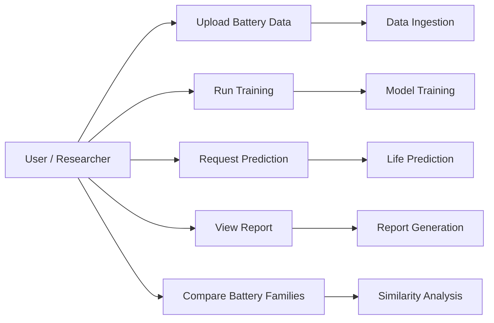
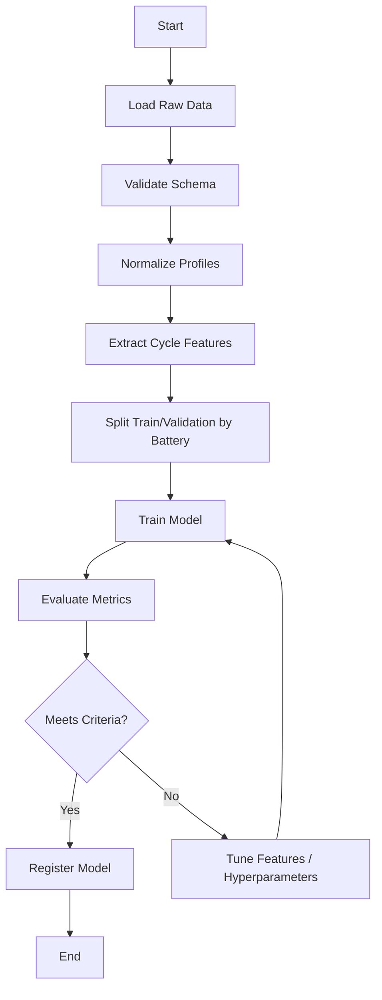
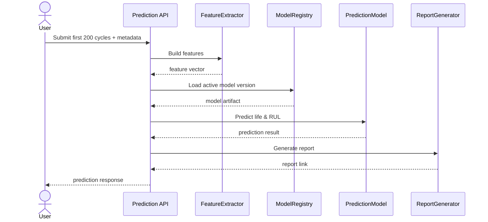
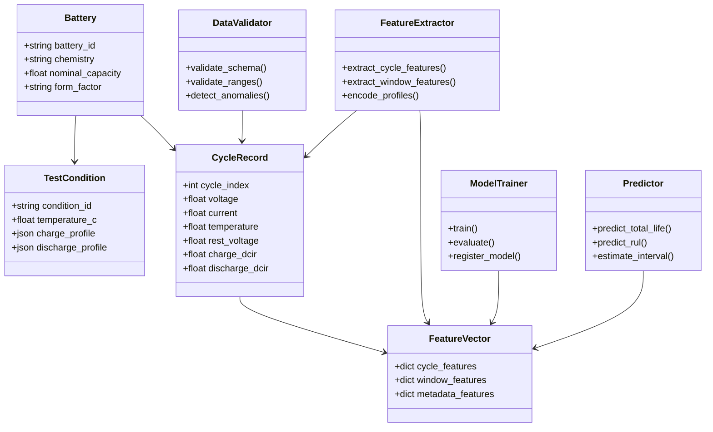
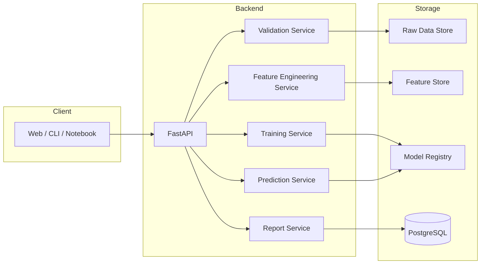
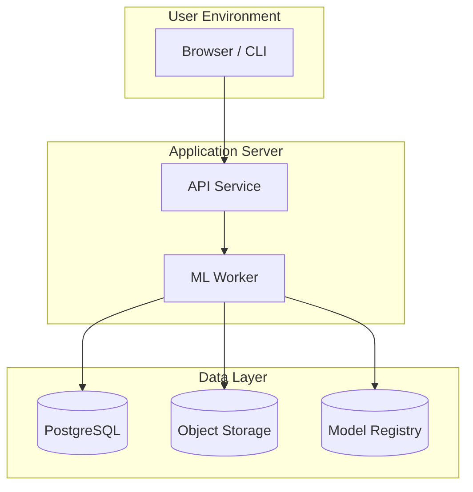

# 배터리 초기 수명 특성 기반 장기 수명 예측 시스템 — 통합 명세서

버전: v0.1  
작성일: 2026-05-15  
문서 유형: SRS / FRS / SAD / SDD / UML / OpenAPI / 데이터 스키마 통합

---

## 문서 구성

| Part | 원본 문서 | 내용 |
|------|-----------|------|
| I | `battery_life_prediction_spec.md` | 요구사항(SRS/FRS), 아키텍처(SAD), 상세설계(SDD), UML, 로드맵 |
| II | `battery_openapi_and_schema_spec.md` | REST API(OpenAPI), Request/Response, DB·Feature Store 스키마 |

---

# Part I. 요구사항 및 시스템 설계

## 배터리 초기 수명 특성을 이용한 장기 수명 예측 시스템 명세서
버전: v0.1  
작성일: 2026-05-15  
문서 유형: SRS / FRS / SAD / SDD / UML 통합 초안

---

## 1. 문서 목적

본 문서는 배터리의 **초기 수명 특성(early-life features)** 을 활용하여 **장기 수명(cycle life)** 을 예측하는 소프트웨어 시스템의 요구사항과 설계 원칙을 정의한다.  
본 시스템은 다음 목적을 가진다.

- 배터리 초기 200사이클 내 데이터로부터 1200사이클 이상 수명을 예측
- 온도 조건별(15℃, 23℃, 45℃) 수명 열화 패턴을 학습
- 충전/방전 프로파일의 차이를 반영하여 유사 배터리의 장기 수명 추정
- 실험 데이터 기반의 재현 가능한 분석과 모델 학습/추론 파이프라인 제공

---

## 2. 시스템 개요

### 2.1 문제 정의

배터리 수명 평가는 일반적으로 전체 수명 시험이 완료되어야 정확한 결과를 얻을 수 있다. 그러나 실제 개발 현장에서는 시간과 비용의 제약으로 인해 **초기 몇 백 사이클의 데이터만으로 최종 수명을 예측**할 필요가 있다.

본 시스템은 배터리의 다음 정보를 이용한다.

- 온도 환경: **15℃, 23℃, 45℃**
- 사이클 데이터: 각 cycle별 전압, 전류, 배터리 온도, rest voltage
- 저항 데이터: 충전/방전 DCIR, SOC 30% / 50% / 70%에서의 저항
- 충전 조건: 4단계 프로파일
- 방전 조건: 2단계 프로파일

### 2.2 예측 목표

- 입력: 배터리의 **초기 200사이클 정보**
- 출력: 해당 배터리의 **예상 총 수명(cycle life)** 및 **남은 수명(RUL, Remaining Useful Life)**
- 기준: 일반적으로는 **용량 유지율 80% 도달 시점**을 EOL(End-of-Life)로 정의하되, 시스템 설정으로 변경 가능

### 2.3 주요 활용 시나리오

1. 신규 셀의 조기 스크리닝
2. 제조 공정 변경 전후 수명 영향 비교
3. 온도별 열화 민감도 분석
4. 유사 배터리군에 대한 수명 추정
5. 실험 종료 이전의 빠른 의사결정 지원

---

## 3. 용어 정의

| 용어 | 정의 |
|---|---|
| Cycle | 충전 + 방전 + rest 등을 포함한 1회 반복 시험 단위 |
| RUL | 현재 시점 이후 남은 예상 수명 |
| EOL | 배터리 수명이 종료되는 시점 |
| DCIR | Direct Current Internal Resistance |
| Rest Voltage | 휴지 상태에서 측정된 전압 |
| SOC | State of Charge |
| Similar Battery | 화학계, 용량, 폼팩터, 시험 조건이 유사한 배터리 |
| Early-life feature | 초기 몇 사이클에서 추출한 수명 예측용 특징값 |

---

# 4. SRS (Software Requirements Specification)

## 4.1 목적

본 SRS는 시스템이 무엇을 해야 하는지에 대한 요구사항을 정의한다.  
대상은 데이터 엔지니어, ML 엔지니어, 배터리 연구자, 테스트 엔지니어, 시스템 운영자이다.

## 4.2 시스템 범위

시스템은 다음 기능을 포함한다.

- 배터리 원천 데이터 수집 및 정합성 검증
- 사이클 단위 특성 추출
- 온도별 모델 학습
- 초기 200사이클 기반 수명 예측
- 결과 시각화 및 리포트 출력
- 모델 버전 관리 및 재현성 보장

시스템은 다음을 직접 수행하지 않는다.

- 실제 배터리 충방전 실험 장비 제어
- 하드웨어 센서 보정 알고리즘 자체 개발
- 배터리 화학 반응의 물리 기반 시뮬레이션만으로 수명 예측

## 4.3 이해관계자

| 이해관계자 | 관심사 |
|---|---|
| 배터리 연구원 | 수명 예측 정확도, 열화 특성 해석 |
| 데이터 엔지니어 | 데이터 수집, 결측 처리, 품질 관리 |
| ML 엔지니어 | 모델 성능, 학습 파이프라인, 배포 |
| 품질/개발 부서 | 조기 판정 기준, 의사결정 속도 |
| 운영자 | 시스템 안정성, 로그, 재현성 |

## 4.4 사용자 시나리오

### UC-01 데이터 업로드
사용자는 배터리별 측정 파일을 업로드하고, 시스템은 파일 형식을 검증한 뒤 데이터 레이크 또는 DB에 적재한다.

### UC-02 학습 실행
사용자는 23℃ 및 45℃ 조건의 장기 수명 데이터를 사용하여 모델 학습을 실행한다.

### UC-03 초기 수명 기반 예측
사용자는 신규 배터리의 초기 200사이클 데이터를 입력하고, 시스템으로부터 총 수명 예측값과 신뢰도를 받는다.

### UC-04 비교 분석
사용자는 동일 계열 배터리 간 예측 수명과 실제 수명을 비교한다.

## 4.5 기능 요구사항

### FR-01 데이터 적재
시스템은 배터리 시험 데이터를 CSV, Parquet, JSON 또는 DB 테이블 형태로 적재할 수 있어야 한다.

### FR-02 시험 조건 메타데이터 관리
시스템은 배터리 ID, 셀 타입, 온도, 충전/방전 프로파일, 시험 시작일, 측정 장비 정보를 저장해야 한다.

### FR-03 사이클 단위 파싱
시스템은 각 배터리의 cycle 단위 데이터를 분리하고 cycle index를 부여해야 한다.

### FR-04 품질 검증
시스템은 비정상 값, 결측치, 중복 cycle, 시간 역행, 물리적으로 불가능한 전압/전류 값을 탐지해야 한다.

### FR-05 특징 추출
시스템은 cycle별 전압/전류/온도/rest voltage/DCIR/SOC 저항 기반 특징을 추출해야 한다.

### FR-06 학습 데이터 구성
시스템은 23℃ 및 45℃ 조건의 장기 수명 데이터 중 학습 가능한 샘플을 구성해야 한다.

### FR-07 예측 모델 학습
시스템은 선택된 모델 알고리즘으로 수명 예측 모델을 학습해야 한다.

### FR-08 초기 200사이클 기반 추론
시스템은 200사이클 이내 입력만으로 최종 수명 예측을 수행해야 한다.

### FR-09 온도별 일반화
시스템은 15℃, 23℃, 45℃ 조건 간 분포 차이를 고려하여 예측해야 한다.

### FR-10 유사 배터리 매칭
시스템은 입력 배터리와 유사한 배터리 집합을 탐색하거나 학습된 embedding 공간에서 근접 샘플을 활용해야 한다.

### FR-11 결과 출력
시스템은 예측 총 수명, RUL, 신뢰구간, 주요 영향 특징을 출력해야 한다.

### FR-12 모델 버전 관리
시스템은 학습 데이터, 하이퍼파라미터, 모델 파일, 평가 결과를 버전별로 저장해야 한다.

### FR-13 감사 로그
시스템은 데이터 업로드, 학습, 예측, 모델 교체 이력을 기록해야 한다.

## 4.6 비기능 요구사항

### NFR-01 정확도
주요 평가 지표는 MAE, RMSE, MAPE, C-index, Spearman correlation을 포함해야 한다.

### NFR-02 재현성
동일한 입력 데이터와 동일한 모델 버전으로 예측 시 동일한 결과가 재현되어야 한다.

### NFR-03 확장성
데이터 배치 크기 증가 시 수평 확장이 가능해야 한다.

### NFR-04 성능
초기 200사이클 입력에 대한 배치 추론은 실무적으로 허용 가능한 시간 내에 완료되어야 한다.

### NFR-05 유지보수성
특징 추출, 모델 학습, 추론, 리포트 생성은 모듈 단위로 분리되어야 한다.

### NFR-06 보안
데이터 및 모델 파일은 접근 권한을 제어해야 한다.

### NFR-07 추적성
각 예측 결과는 사용된 데이터 범위, 모델 버전, 실행 시각을 추적할 수 있어야 한다.

### NFR-08 확장 가능성
향후 60℃, 0℃ 등 추가 온도나 다른 charge profile이 추가되어도 구조 변경을 최소화해야 한다.

## 4.7 데이터 요구사항

### 입력 데이터 핵심 항목
- Battery ID
- Cell chemistry / type
- Temperature condition
- Cycle index
- Charge step profile
- Discharge step profile
- Voltage
- Current
- Cell temperature
- Rest voltage
- Charge DCIR
- Discharge DCIR
- SOC 30%, 50%, 70% resistance
- Capacity / coulomb count / timestamps(가능한 경우)

### 시간 해상도
- cycle-level aggregation을 기본 단위로 사용
- 필요 시 step-level raw signal도 저장 가능

### 데이터 범위
- 23℃: 1200사이클 이상 학습용 확보
- 45℃: 800사이클 이상 학습용 확보
- 15℃: 동일 구조로 입력 가능하며, 초기에는 검증 또는 일반화 평가에 사용

## 4.8 수용 기준

- 초기 200사이클만으로 총 수명 예측값을 산출할 것
- 학습 데이터는 온도별 조건 차이를 반영할 것
- 배터리별 charge/discharge profile 차이를 메타데이터로 관리할 것
- 결과에 신뢰도 또는 예측 구간이 포함될 것
- 예측 과정이 재현 가능해야 할 것

---

# 5. FRS (Functional Requirements Specification)

## 5.1 기능 개요

시스템 기능은 다음 6개 영역으로 구성된다.

1. 데이터 수집 및 정규화
2. 특징 추출
3. 모델 학습
4. 모델 평가
5. 추론 및 RUL 예측
6. 결과 해석 및 리포트

## 5.2 데이터 수집 및 정규화 기능

### FRS-01 파일/DB 수신
- 입력 원천은 파일 업로드 또는 DB 연결일 수 있다.
- 시스템은 입력 형식에 따라 적절한 파서를 선택해야 한다.

### FRS-02 스키마 검증
- 필수 컬럼 누락 시 오류를 발생시켜야 한다.
- 단위가 혼재된 경우 표준 단위로 변환해야 한다.

### FRS-03 메타데이터 정규화
- charge profile이 배터리마다 다를 수 있으므로, step descriptor를 표준 구조로 정규화해야 한다.

예시 step descriptor:
```json
{
  "charge_steps": [
    {"mode": "CC", "rate": "2C", "until": "V_design"},
    {"mode": "CC", "rate": "1.6C", "until": "V_design"},
    {"mode": "CC-CV", "cc_rate": "1.3C", "cv_until_current": "1C"},
    {"mode": "CC-CV", "cc_rate": "1C", "cv_voltage": "4.55V", "cv_until_current": "0.1C"}
  ],
  "discharge_steps": [
    {"mode": "CC", "rate": "1C", "until": "V_design"},
    {"mode": "CC", "rate": "0.5C", "until": "V_min"}
  ]
}
```

## 5.3 특징 추출 기능

### FRS-04 cycle feature 생성
각 cycle에 대해 다음 특징을 생성해야 한다.

- 평균/최대/최소 전압
- 평균/최대/최소 전류
- 평균/최대 셀 온도
- rest voltage 통계
- charge DCIR / discharge DCIR
- SOC 30/50/70 저항
- voltage drop slope
- capacity fade slope
- charge time / discharge time
- step transition 특성

### FRS-05 시계열 윈도우 특징
초기 200사이클을 다음과 같이 요약해야 한다.

- cycle 1~20
- cycle 21~50
- cycle 51~100
- cycle 101~200

각 구간별 평균, 분산, 추세, 기울기를 계산한다.

### FRS-06 열화 지표 생성
다음과 같은 열화 지표를 생성해야 한다.

- ΔV trend
- ΔR trend
- ΔCapacity trend
- temperature sensitivity index
- DCIR growth rate
- rest voltage drift

## 5.4 모델 학습 기능

### FRS-07 학습 대상 선택
- 23℃와 45℃의 장기 수명 데이터를 기본 학습 데이터로 사용
- 15℃는 검증 또는 외삽 성능 평가 데이터로 사용 가능

### FRS-08 모델 후보
시스템은 다음 모델을 선택적으로 지원해야 한다.

- XGBoost / LightGBM
- Random Forest
- Temporal CNN
- LSTM / GRU
- Transformer encoder
- Hybrid model (feature-based + sequence-based)

### FRS-09 다중 입력 처리
모델은 다음 입력을 함께 사용할 수 있어야 한다.

- cycle-level numerical features
- temperature condition
- charge/discharge profile embeddings
- battery metadata

### FRS-10 타깃 정의
시스템은 다음 타깃을 학습할 수 있어야 한다.

- total cycle life
- RUL at cycle 200
- EOL cycle
- remaining capacity trajectory(선택)

## 5.5 모델 평가 기능

### FRS-11 학습/검증 분리
- battery-level split을 수행해야 한다.
- 동일 배터리의 cycle이 train/test에 동시에 들어가면 안 된다.

### FRS-12 평가 지표
- MAE
- RMSE
- MAPE
- Spearman correlation
- R²
- prediction interval coverage

### FRS-13 온도별 성능 분석
- 15℃, 23℃, 45℃ 각각의 성능을 분리하여 보고해야 한다.

## 5.6 추론 기능

### FRS-14 초기 데이터 입력
사용자는 첫 200사이클까지만 입력하여 예측할 수 있어야 한다.

### FRS-15 결과 반환
반환 결과에는 다음 항목이 포함되어야 한다.

- predicted total life
- predicted RUL
- confidence score
- prediction interval
- top contributing features

### FRS-16 유사 배터리 기반 추론
시스템은 입력 배터리와 유사한 학습 샘플의 평균 패턴을 참고할 수 있어야 한다.

## 5.7 해석 및 리포트 기능

### FRS-17 특징 중요도 산출
- permutation importance, SHAP, attention weight 중 하나 이상 제공

### FRS-18 리포트 생성
- 예측 결과 요약
- 입력 데이터 품질 상태
- 모델 버전
- 비교 대상 배터리군
- 해석 가능한 주요 특징

---

# 6. SAD (Software Architecture Design)

## 6.1 아키텍처 스타일

권장 아키텍처는 다음의 조합이다.

- **Layered Architecture**
- **Pipeline-based ML Architecture**
- **MLOps-friendly modular design**

### 주요 계층
1. Presentation Layer
2. API Layer
3. Application/Service Layer
4. Domain Layer
5. Data Access Layer
6. ML Pipeline Layer
7. Storage Layer

## 6.2 핵심 아키텍처 원칙

- 데이터 정규화와 특징 추출은 학습/추론에서 동일 코드 사용
- 모델 학습과 예측을 분리
- 원천 데이터와 파생 특징을 분리 저장
- 온도 및 시험 조건 메타데이터를 1급 객체로 다룸
- 모델과 데이터의 버전 대응 관계를 보존

## 6.3 논리 아키텍처

### 1) Ingestion Service
- 파일 업로드 / DB 커넥터 / ETL
- raw data 저장

### 2) Validation Service
- schema check
- range check
- missing value handling
- anomaly detection

### 3) Feature Engineering Service
- cycle aggregation
- window statistics
- degradation trend features
- profile encoding

### 4) Training Service
- 데이터 분할
- 모델 학습
- 하이퍼파라미터 탐색
- 모델 저장

### 5) Prediction Service
- 초기 200사이클 입력 수신
- feature 생성
- model inference
- 결과 및 confidence 산출

### 6) Reporting Service
- 결과 시각화
- PDF/HTML/MD 리포트 생성
- 비교 분석

## 6.4 권장 기술 스택

| 영역 | 권장 기술 |
|---|---|
| 언어 | Python |
| 데이터 처리 | pandas, numpy, polars(선택) |
| ML | scikit-learn, XGBoost, LightGBM, PyTorch |
| API | FastAPI |
| 저장소 | PostgreSQL, Parquet, S3-compatible storage |
| 실험 추적 | MLflow |
| 오케스트레이션 | Airflow 또는 Prefect |
| 시각화 | matplotlib, plotly |
| 배포 | Docker, Kubernetes(선택) |
| 품질 관리 | Great Expectations(선택) |

## 6.5 데이터 흐름

1. 원천 시험 데이터 수신
2. 스키마 검증 및 정규화
3. cycle-level feature 생성
4. 학습 데이터셋 구성
5. 모델 학습 및 평가
6. 모델 등록
7. 신규 배터리 200사이클 입력
8. 추론 및 결과 생성
9. 리포트 저장 및 배포

## 6.6 주요 설계 판단

### 이유 1: 계층화
배터리 도메인 로직과 ML 로직이 혼재하지 않도록 분리한다.

### 이유 2: 파이프라인 분리
데이터 전처리와 모델 학습이 반복 실행되므로 파이프라인화가 필수이다.

### 이유 3: 온도 조건의 명시적 모델링
온도는 열화 속도에 큰 영향을 주므로 단순 입력값이 아니라 핵심 조건으로 다룬다.

### 이유 4: 프로파일 메타데이터 활용
충전/방전 조건이 배터리마다 다르므로, 단순 수치형 특징 외에 step profile encoding이 필요하다.

---

# 7. SDD (Software Design Description)

## 7.1 모듈 구조

```text
battery_life_predictor/
├── app/
│   ├── api/
│   ├── services/
│   ├── schemas/
│   └── main.py
├── core/
│   ├── config.py
│   ├── logging.py
│   └── exceptions.py
├── domain/
│   ├── battery.py
│   ├── cycle.py
│   ├── profile.py
│   └── features.py
├── data/
│   ├── ingestion/
│   ├── validation/
│   ├── preprocessing/
│   └── repository.py
├── ml/
│   ├── feature_engineering/
│   ├── training/
│   ├── evaluation/
│   ├── inference/
│   └── explainability/
├── storage/
│   ├── model_registry/
│   ├── feature_store/
│   └── dataset_store/
├── reports/
├── tests/
└── notebooks/
```

## 7.2 도메인 객체 설계

### Battery
- battery_id
- chemistry
- nominal_capacity
- form_factor
- test_condition
- charge_profile
- discharge_profile

### CycleRecord
- cycle_index
- timestamp
- voltage_series
- current_series
- temperature_series
- rest_voltage
- charge_dcir
- discharge_dcir
- soc_resistance_30
- soc_resistance_50
- soc_resistance_70

### FeatureVector
- raw_cycle_features
- window_features
- profile_embedding
- metadata_features
- target_label

## 7.3 핵심 클래스 설계

### 7.3.1 DataIngestionManager
책임:
- raw file load
- format detection
- storage write
- ingestion log 생성

### 7.3.2 DataValidator
책임:
- 필수 필드 검증
- 물리 범위 검증
- cycle continuity 검증
- 이상치 플래그 생성

### 7.3.3 FeatureExtractor
책임:
- cycle statistics 계산
- 200사이클 window summary 생성
- charge/discharge profile 인코딩
- resistance trend 계산

### 7.3.4 ModelTrainer
책임:
- train/validation split
- model fitting
- hyperparameter tuning
- metrics computation
- model serialization

### 7.3.5 Predictor
책임:
- 신규 배터리 feature 생성
- 모델 로드
- 수명 예측
- confidence interval 생성

### 7.3.6 ReportGenerator
책임:
- 결과 요약 텍스트 생성
- 그래프 생성
- markdown/html/pdf 리포트 저장

## 7.4 인터페이스 설계

### 7.4.1 학습 API
```http
POST /train
Content-Type: application/json
```

Request:
- dataset_id
- temperature_filters
- model_type
- target_definition
- feature_config

Response:
- training_run_id
- model_version
- evaluation_summary

### 7.4.2 예측 API
```http
POST /predict
Content-Type: application/json
```

Request:
- battery_id
- first_200_cycle_data
- metadata

Response:
- predicted_total_life
- predicted_rul
- prediction_interval
- confidence_score
- top_features

### 7.4.3 리포트 API
```http
GET /reports/{run_id}
```

Response:
- report link
- model version
- data version

## 7.5 데이터베이스 설계 초안

### Table: batteries
- battery_id (PK)
- chemistry
- capacity
- form_factor
- created_at

### Table: test_conditions
- condition_id (PK)
- battery_id (FK)
- temperature_c
- charge_profile_json
- discharge_profile_json

### Table: cycle_raw_data
- record_id (PK)
- battery_id (FK)
- cycle_index
- timestamp
- voltage
- current
- temperature
- rest_voltage
- stage_name

### Table: cycle_features
- feature_id (PK)
- battery_id (FK)
- cycle_index
- feature_vector_json
- created_at

### Table: model_runs
- run_id (PK)
- model_name
- model_version
- dataset_version
- train_metrics_json
- created_at

### Table: predictions
- prediction_id (PK)
- battery_id (FK)
- run_id (FK)
- predicted_total_life
- predicted_rul
- interval_json
- confidence_score
- created_at

## 7.6 예외 처리

- MissingFieldError
- InvalidUnitError
- OutOfRangeError
- InconsistentCycleError
- DataLeakageError
- ModelNotFoundError
- PredictionInputTooShortError

## 7.7 로깅 및 감사 추적

로그에 반드시 포함:
- dataset version
- model version
- feature config version
- execution time
- user/request id
- battery id
- temperature condition

## 7.8 테스트 전략

### 단위 테스트
- feature 계산 함수
- validation rule
- profile parser

### 통합 테스트
- ingest → preprocess → train → predict
- batch inference flow

### 회귀 테스트
- 이전 모델 버전과의 예측 결과 비교

### 데이터 테스트
- 분포 변화 탐지
- 결측률/이상치율 확인

---

# 8. UML

아래 UML은 Markdown Mermaid 문법을 사용한다.

## 8.1 Use Case Diagram



## 8.2 Activity Diagram - 학습 흐름



## 8.3 Sequence Diagram - 예측 요청



## 8.4 Class Diagram



## 8.5 Component Diagram



## 8.6 Deployment Diagram



---

# 9. 권장 구현 로드맵

## Phase 1. 데이터 파이프라인
- raw data ingestion
- schema validation
- cycle parser
- feature store 구축

## Phase 2. 베이스라인 모델
- XGBoost / LightGBM 기반 회귀 모델
- battery-level split 평가
- 온도별 성능 분석

## Phase 3. 고도화 모델
- sequence model 도입
- profile embedding 추가
- uncertainty estimation 추가

## Phase 4. 제품화
- API 서비스화
- 대시보드 구축
- 모델 버전 관리 자동화
- 리포트 생성 자동화

---

# 10. 주요 리스크 및 대응

| 리스크 | 영향 | 대응 |
|---|---|---|
| 배터리별 charge profile 상이 | 특징 정합성 저하 | profile metadata 표준화 |
| 데이터 수 부족 | 과적합 | battery-level CV, regularization |
| 15℃ 데이터 분포 차이 | 외삽 성능 저하 | domain-aware features, calibration |
| EOL 정의 불일치 | 타깃 혼선 | EOL threshold configurable |
| 장기 데이터 편향 | 특정 조건 과적합 | 온도별 stratified evaluation |
| 센서 노이즈 | feature 왜곡 | smoothing, anomaly filtering |

---

# 11. 결론

본 문서는 배터리 초기 수명 정보를 활용하여 장기 수명을 예측하는 시스템의 요구사항과 설계를 통합적으로 정의한다.  
핵심은 **온도 조건**, **사이클별 전기적 특성**, **SOC별 저항**, **충전/방전 프로파일 차이**를 정규화된 구조로 관리하고, 초기 200사이클의 특징만으로 총 수명과 RUL을 예측하는 것이다.  
실제 구현 시에는 데이터 구조 표준화, 배터리 단위 분리 검증, 불확실성 추정, 모델 버전 관리가 성공의 핵심 요소가 된다.

---

# 12. 다음 단계 제안

- 본 통합 문서 Part II(OpenAPI 및 데이터 스키마) 상세 검토
- 예측 타깃(EOL 정의) 확정
- feature list와 계산식 상세화
- 테스트 케이스 및 샘플 데이터 정의

---

# Part II. OpenAPI 명세 및 데이터 스키마

## 배터리 장기 수명 예측 시스템 — OpenAPI 및 데이터 스키마

# 13. 문서 목적

본 문서는 배터리 초기 수명 특성을 활용한 장기 수명 예측 시스템의 다음 항목을 정의한다.

- REST API(OpenAPI) 명세
- Request / Response 스키마
- 데이터 저장 구조
- Feature Store 스키마
- 학습 데이터셋 스키마
- 모델 메타데이터 구조
- 이벤트 및 로그 스키마

본 문서는 이전 SRS/FRS/SAD/SDD 문서를 기반으로 작성되었다.

---

# 14. 시스템 API 개요

## 14.1 API 스타일

- RESTful API
- JSON 기반 통신
- UTF-8 인코딩
- OpenAPI 3.1 준수

## 14.2 Base URL

```text
https://battery-life-api.company.com/api/v1
```

## 14.3 인증 방식

권장:
- OAuth2
- JWT Token

예시:

```http
Authorization: Bearer <access_token>
```

---

# 15. OpenAPI 명세

# 15.1 Health Check API

## Endpoint

```http
GET /health
```

## Response

```json
{
  "status": "healthy",
  "service": "battery-life-predictor",
  "version": "1.0.0",
  "timestamp": "2026-05-15T10:00:00Z"
}
```

---

# 15.2 Dataset Upload API

## Endpoint

```http
POST /datasets/upload
```

## Description

배터리 시험 데이터를 업로드한다.

## Content-Type

```http
multipart/form-data
```

## Request Parameters

| Field | Type | Required | Description |
|---|---|---|---|
| file | binary | Y | CSV/Parquet/JSON |
| dataset_name | string | Y | 데이터셋 이름 |
| chemistry | string | N | LCO/NMC/LFP 등 |
| description | string | N | 설명 |

## Response

```json
{
  "dataset_id": "ds_20260515_001",
  "status": "uploaded",
  "records": 1250000,
  "batteries": 320,
  "created_at": "2026-05-15T10:00:00Z"
}
```

---

# 15.3 Dataset Validation API

## Endpoint

```http
POST /datasets/{dataset_id}/validate
```

## Description

업로드된 데이터셋의 품질을 검증한다.

## Response

```json
{
  "dataset_id": "ds_20260515_001",
  "status": "validated",
  "summary": {
    "missing_ratio": 0.001,
    "duplicate_cycles": 0,
    "outlier_records": 14
  },
  "warnings": [
    "Battery BAT_104 has inconsistent temperature records"
  ]
}
```

---

# 15.4 Feature Engineering API

## Endpoint

```http
POST /features/generate
```

## Request

```json
{
  "dataset_id": "ds_20260515_001",
  "feature_config": {
    "window_sizes": [20, 50, 100, 200],
    "include_dcir": true,
    "include_rest_voltage": true,
    "include_profile_embedding": true
  }
}
```

## Response

```json
{
  "feature_dataset_id": "feat_20260515_001",
  "features_generated": 248,
  "status": "completed"
}
```

---

# 15.5 Model Training API

## Endpoint

```http
POST /train
```

## Request

```json
{
  "feature_dataset_id": "feat_20260515_001",
  "model_type": "xgboost",
  "target_definition": {
    "eol_capacity_ratio": 0.8
  },
  "temperature_filters": [23, 45],
  "train_config": {
    "test_ratio": 0.2,
    "random_seed": 42,
    "cross_validation": true
  }
}
```

## Response

```json
{
  "run_id": "train_20260515_001",
  "model_version": "v1.0.0",
  "status": "training_started"
}
```

---

# 15.6 Training Status API

## Endpoint

```http
GET /train/{run_id}
```

## Response

```json
{
  "run_id": "train_20260515_001",
  "status": "completed",
  "metrics": {
    "mae": 58.2,
    "rmse": 77.3,
    "mape": 4.1,
    "r2": 0.91
  },
  "model_version": "v1.0.0"
}
```

---

# 15.7 Prediction API

## Endpoint

```http
POST /predict
```

## Description

초기 200사이클 데이터를 기반으로 총 수명을 예측한다.

## Request

```json
{
  "battery_id": "BAT_2026_001",
  "temperature_c": 23,
  "cycles": [
    {
      "cycle_index": 1,
      "avg_voltage": 4.12,
      "avg_current": 1.5,
      "avg_temperature": 25.1,
      "rest_voltage": 4.03,
      "charge_dcir": 14.2,
      "discharge_dcir": 15.8,
      "soc30_resistance": 13.1,
      "soc50_resistance": 12.5,
      "soc70_resistance": 12.9
    }
  ],
  "metadata": {
    "chemistry": "LCO",
    "nominal_capacity_ah": 3.2
  }
}
```

## Response

```json
{
  "battery_id": "BAT_2026_001",
  "predicted_total_life": 1320,
  "predicted_rul": 1120,
  "prediction_interval": {
    "lower": 1240,
    "upper": 1390
  },
  "confidence_score": 0.92,
  "top_features": [
    "dcir_growth_rate",
    "rest_voltage_drift",
    "temperature_gradient"
  ],
  "model_version": "v1.0.0"
}
```

---

# 15.8 Report Generation API

## Endpoint

```http
POST /reports/generate
```

## Request

```json
{
  "prediction_id": "pred_20260515_001",
  "report_format": "pdf"
}
```

## Response

```json
{
  "report_id": "rpt_20260515_001",
  "download_url": "/reports/rpt_20260515_001.pdf"
}
```

---

# 15.9 Model Registry API

## Endpoint

```http
GET /models
```

## Response

```json
{
  "models": [
    {
      "model_version": "v1.0.0",
      "model_type": "xgboost",
      "created_at": "2026-05-15T12:00:00Z",
      "status": "production"
    }
  ]
}
```

---

# 16. 공통 데이터 스키마

# 16.1 Battery Metadata Schema

```json
{
  "battery_id": "string",
  "chemistry": "string",
  "manufacturer": "string",
  "form_factor": "string",
  "nominal_capacity_ah": "float",
  "nominal_voltage_v": "float",
  "production_date": "datetime",
  "batch_id": "string"
}
```

---

# 16.2 Test Condition Schema

```json
{
  "condition_id": "string",
  "temperature_c": "float",
  "humidity_percent": "float",
  "charge_profile": {},
  "discharge_profile": {},
  "eol_definition": {
    "capacity_retention": 0.8
  }
}
```

---

# 16.3 Charge Profile Schema

```json
{
  "charge_steps": [
    {
      "step_no": 1,
      "mode": "CC",
      "rate_c": 2.0,
      "until_voltage_v": 4.35
    },
    {
      "step_no": 2,
      "mode": "CC",
      "rate_c": 1.6,
      "until_voltage_v": 4.35
    },
    {
      "step_no": 3,
      "mode": "CC_CV",
      "rate_c": 1.3,
      "cv_voltage_v": 4.45,
      "until_current_c": 1.0
    },
    {
      "step_no": 4,
      "mode": "CC_CV",
      "rate_c": 1.0,
      "cv_voltage_v": 4.55,
      "until_current_c": 0.1
    }
  ]
}
```

---

# 16.4 Discharge Profile Schema

```json
{
  "discharge_steps": [
    {
      "step_no": 1,
      "mode": "CC",
      "rate_c": 1.0,
      "until_voltage_v": 3.3
    },
    {
      "step_no": 2,
      "mode": "CC",
      "rate_c": 0.5,
      "until_voltage_v": 3.0
    }
  ]
}
```

---

# 16.5 Raw Cycle Data Schema

## Column Definition

| Column | Type | Unit | Description |
|---|---|---|---|
| battery_id | string | - | 배터리 ID |
| cycle_index | integer | - | cycle 번호 |
| timestamp | datetime | - | 측정 시각 |
| stage_name | string | - | charge/discharge/rest |
| voltage_v | float | V | 전압 |
| current_a | float | A | 전류 |
| temperature_c | float | ℃ | 셀 온도 |
| rest_voltage_v | float | V | 휴지 전압 |
| charge_dcir_mohm | float | mΩ | 충전 DCIR |
| discharge_dcir_mohm | float | mΩ | 방전 DCIR |
| soc30_resistance_mohm | float | mΩ | SOC30 저항 |
| soc50_resistance_mohm | float | mΩ | SOC50 저항 |
| soc70_resistance_mohm | float | mΩ | SOC70 저항 |

---

# 16.6 Aggregated Cycle Feature Schema

```json
{
  "battery_id": "BAT_001",
  "cycle_index": 100,
  "features": {
    "avg_voltage": 4.12,
    "max_voltage": 4.55,
    "avg_current": 1.25,
    "avg_temperature": 27.4,
    "rest_voltage_mean": 4.01,
    "charge_dcir": 14.3,
    "discharge_dcir": 15.2,
    "dcir_growth_rate": 0.013,
    "capacity_fade_rate": 0.002,
    "temperature_gradient": 0.12
  }
}
```

---

# 16.7 Window Feature Schema

```json
{
  "battery_id": "BAT_001",
  "window": "1_200",
  "statistics": {
    "voltage_mean": 4.11,
    "voltage_std": 0.08,
    "current_mean": 1.22,
    "dcir_slope": 0.0032,
    "temperature_variance": 1.8,
    "rest_voltage_drift": 0.015
  }
}
```

---

# 17. 데이터베이스 스키마

# 17.1 batteries

| Column | Type | Key |
|---|---|---|
| battery_id | VARCHAR(64) | PK |
| chemistry | VARCHAR(32) | |
| manufacturer | VARCHAR(64) | |
| nominal_capacity_ah | FLOAT | |
| form_factor | VARCHAR(32) | |
| created_at | TIMESTAMP | |

---

# 17.2 test_conditions

| Column | Type | Key |
|---|---|---|
| condition_id | VARCHAR(64) | PK |
| battery_id | VARCHAR(64) | FK |
| temperature_c | FLOAT | |
| charge_profile_json | JSONB | |
| discharge_profile_json | JSONB | |
| created_at | TIMESTAMP | |

---

# 17.3 raw_cycle_data

| Column | Type | Key |
|---|---|---|
| record_id | BIGSERIAL | PK |
| battery_id | VARCHAR(64) | FK |
| cycle_index | INTEGER | |
| timestamp | TIMESTAMP | |
| stage_name | VARCHAR(32) | |
| voltage_v | FLOAT | |
| current_a | FLOAT | |
| temperature_c | FLOAT | |
| rest_voltage_v | FLOAT | |
| charge_dcir_mohm | FLOAT | |
| discharge_dcir_mohm | FLOAT | |

---

# 17.4 cycle_features

| Column | Type | Key |
|---|---|---|
| feature_id | BIGSERIAL | PK |
| battery_id | VARCHAR(64) | FK |
| cycle_index | INTEGER | |
| feature_vector | JSONB | |
| created_at | TIMESTAMP | |

---

# 17.5 model_registry

| Column | Type | Key |
|---|---|---|
| model_version | VARCHAR(64) | PK |
| model_type | VARCHAR(32) | |
| dataset_version | VARCHAR(64) | |
| hyperparameters | JSONB | |
| metrics | JSONB | |
| artifact_uri | TEXT | |
| created_at | TIMESTAMP | |

---

# 17.6 predictions

| Column | Type | Key |
|---|---|---|
| prediction_id | VARCHAR(64) | PK |
| battery_id | VARCHAR(64) | FK |
| model_version | VARCHAR(64) | FK |
| predicted_total_life | FLOAT | |
| predicted_rul | FLOAT | |
| confidence_score | FLOAT | |
| interval_json | JSONB | |
| created_at | TIMESTAMP | |

---

# 18. Feature Store 설계

## Feature Group 예시

| Feature Group | Description |
|---|---|
| cycle_basic_features | cycle 평균 특성 |
| resistance_features | DCIR 및 SOC 저항 |
| degradation_features | 열화 기울기 |
| profile_embedding | 충방전 조건 embedding |
| temperature_features | 온도 관련 특징 |

## Feature Naming Convention

```text
<domain>_<measurement>_<aggregation>
```

예시:

```text
voltage_mean_200
dcir_slope_50
temperature_std_100
```

---

# 19. 모델 메타데이터 스키마

```json
{
  "model_version": "v1.0.0",
  "model_type": "xgboost",
  "training_dataset": "feat_20260515_001",
  "target_definition": {
    "eol_capacity_ratio": 0.8
  },
  "metrics": {
    "mae": 58.2,
    "rmse": 77.3,
    "mape": 4.1
  },
  "feature_config_version": "fc_v1",
  "created_at": "2026-05-15T12:00:00Z"
}
```

---

# 20. 이벤트 및 로그 스키마

# 20.1 Training Event

```json
{
  "event_type": "training_completed",
  "run_id": "train_001",
  "model_version": "v1.0.0",
  "duration_sec": 1240,
  "metrics": {
    "mae": 58.2
  },
  "timestamp": "2026-05-15T12:00:00Z"
}
```

---

# 20.2 Prediction Event

```json
{
  "event_type": "prediction_completed",
  "prediction_id": "pred_001",
  "battery_id": "BAT_001",
  "predicted_total_life": 1320,
  "confidence_score": 0.92,
  "timestamp": "2026-05-15T13:00:00Z"
}
```

---

# 21. 데이터 품질 규칙

| Rule ID | Rule |
|---|---|
| DQ-001 | voltage_v > 0 |
| DQ-002 | current_a 범위는 시스템 설정 범위 이내 |
| DQ-003 | cycle_index는 증가해야 함 |
| DQ-004 | temperature_c는 비현실적 범위를 벗어나면 안 됨 |
| DQ-005 | DCIR 값은 음수가 될 수 없음 |
| DQ-006 | 동일 battery_id + cycle_index 중복 금지 |

---

# 22. 추천 구현 구조

## Backend

- FastAPI
- Pydantic
- SQLAlchemy
- Alembic

## ML

- scikit-learn
- XGBoost
- PyTorch
- MLflow

## Data

- PostgreSQL
- Parquet
- MinIO / S3

## Infra

- Docker
- Kubernetes
- Airflow
- Prometheus / Grafana

---

# 23. 향후 확장 항목

- 실시간 스트리밍 데이터 처리
- 온라인 러닝
- Multi-cell pack modeling
- Physics-informed ML
- Bayesian uncertainty estimation
- Graph Neural Network 기반 셀 관계 모델링
- 온도 외 습도/압력 영향 반영

---

# 24. 결론

본 문서는 배터리 초기 수명 기반 장기 수명 예측 시스템의 OpenAPI 인터페이스와 데이터 스키마를 정의하였다.

핵심 설계 방향은 다음과 같다.

- 배터리 실험 조건의 표준화
- 온도 조건과 충방전 프로파일의 명시적 모델링
- 재현 가능한 Feature Store 구조
- 모델 버전 및 데이터 lineage 추적
- 확장 가능한 MLOps 구조

향후 실제 구현 시에는 본 문서를 기준으로 API 서버, Feature Engineering 파이프라인, 학습 시스템, 예측 서비스, 대시보드 시스템을 병렬 개발할 수 있다.
